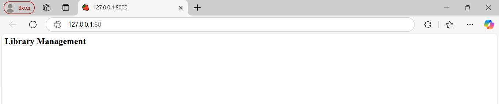
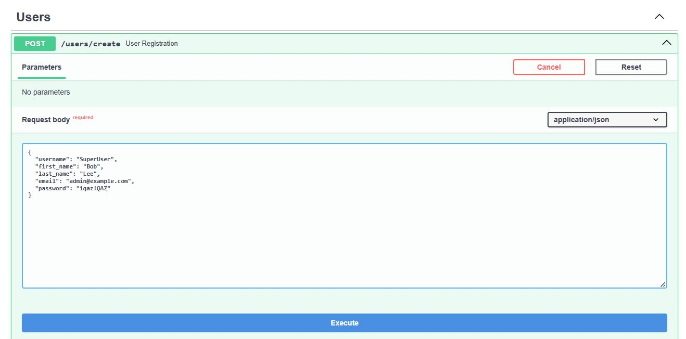

# API для Управления Библиотекой
### Реализация бэкенд сервиса для управление библиотекой 

Используемые технологии:
- Фреймворк: FastAPI
- База данных: PostgreSQL
- ORM: SQLAlchemy
- Аутентификация: JWT
- Управление миграциями: Alembic
- Тестирование: Pytest
- Web-сервер: Nginx

Реализованный функционал:
- авторизация и аутентификация пользователей
- управление книгами
- управление авторами
- управление читателями
- поиск, выдача и возврат книг

## Правила использования

Пользователи разделяются  на: администраторов и читатель.

Администратор может управлять всеми ресурсами. 
Читатель может изменять свои данные, искать книги по автору или названию, а также получать и возвращать книги.

## Запуск проекта

Для развертывания проекта используется `Docker Compose`.

Перед запуском проекта необходимо подготовить env-файл (env файл хранится в репозитории потому, что проект тестовый):

Чтобы запустить проект используем команду:
```
docker compose up -d
```

При первом запуске проекта необходимо выполнить миграции базы данных с помощью Alembic 

```
docker compose exec app alembic upgrade head
```
Стартовая страница проекта [http://127.0.0.1:80](http://127.0.0.1:80).


Страница с интерактивной документацией [http://127.0.0.1:80/docs](http://127.0.0.1:80/docs).


Для начала работы необходимо создать администратора ресурса.
Для этого через запрос /users/create в разделе Users создаем нового пользователя


 В базе данных (можно подключиться с помощью DBeaver) устанавливаем у данного пользователя атрибут is_superuser в значение True или выполняем команды

```
docker compose exec db_lib psql -U postgras -W admin
UPDATE users SET is_superuser = True WHERE id = 1;
```

## Тестирование проекта

Для тестирования проекта необходимо создать тестовую базу командой
```
docker compose -f docker-compose-test.yml up -d
```

Перейти в каталог с тестами
```
cd tests
```

Для тестирования раздела работы с пользователями
```
pytest -v test_user.py
```

Для тестирования раздела работы с авторами
```
pytest -v test_author.py
```

Для тестирования раздела работы с жанрами
```
pytest -v test_genres.py
```

Для тестирования раздела работы с книгами
```
pytest -v test_book.py
```

Для тестирования раздела работы с выдачей
```
pytest -v test_library.py
```

## Licence

Author: Stanislav Rubtsov